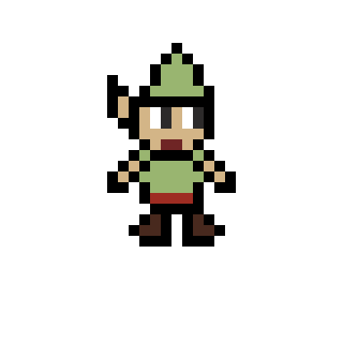

<!--  -->

<!--  -->
<!-- 
<h1 align= "center"><b>Salve Folks! 👾, Here is Eldeeb 💀</b></h1>

A <strong>Back-End Developer</strong> and <strong>Database Management</strong>.

 

 Build robust, scalable, and efficient systems with passion. I specialize in creating clean and optimized back-end solutions, with a focus on performance and reliability. 

-->

###

### Skills:

<!-- 🌟 Skill Icons with Advanced Hover Effects 🌟 -->

    
    
    
    
    
    
    
    
    
    

    
    
    
    
    
    
    
    
    
    

    
    
    
    
    
    
    
    

    
    
    
    
    
    
    
    
    
    
    
    
    
    

    
    
    
    
    
    
    
    
    
    

    
    
    
    
    
    

    
    
    
    

<!-- 🌟 End: Skill Icons with Advanced Hover Effects 🌟 -->

<!--
# 🚀 My Portfolio

👋 Welcome to my personal portfolio. Check out my work and projects by visiting my Portfolio Website:

<a href="https://ziadsharara.github.io/Portfolio/" target="_blank">
  <button style="
    background: linear-gradient(135deg, #FF6347, #FF4500); 
    color: white; 
    font-size: 20px; 
    font-weight: bold; 
    padding: 16px 32px; 
    border-radius: 50px; 
    border: none; 
    transition: transform 0.3s ease, box-shadow 0.3s ease;
    cursor: pointer;
  ">
    🌐 Visit My Portfolio
  </button>
</a>

-->

## Get in Touch

## Statistics 
   
<!--
 
-->

<!--
## Github Achievements

-->

---
<!--
## Get in Touch

-->
